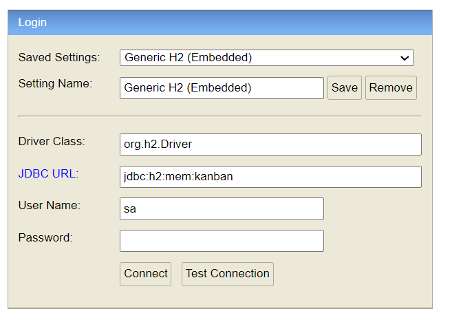

# Kanban - LEANG Denis (WORK IN PROGRESS)

<!-- TABLE OF CONTENTS -->
<details>
  <summary>Table of Contents</summary>
  <ol>
    <li>
      <a href="#about-the-project">About The Project</a>
      <ul>
        <li><a href="#built-with">Built With</a></li>
      </ul>
    </li>
    <li>
      <a href="#getting-started">Getting Started</a>
      <ul>
        <li><a href="#prerequisites">Prerequisites</a></li>
      </ul>
    </li>
    <li><a href="#usage">Usage</a>
      <ul>
        <li><a href="#how-to-open-h2">How to open the H2 database</a></li>
      </ul>
    </li>
    <li><a href="#contact">Contact</a></li>
  </ol>
</details>

<!-- ABOUT THE PROJECT -->
## About The Project

This Kanban is built with Java and Spring Boot.

Session 1 and 2 : Last commit on the 24th of October  
Session 3 and 4 : Last commit on the 4th of December  
Session 5 :  

### Built With

* [Spring Boot](https://spring.io/projects/spring-boot)

<p align="right">(<a href="#top">back to top</a>)</p>

<!-- GETTING STARTED -->
## Getting Started

### Prerequisites

Clone the repository with SSH or HTTPS
   ```sh
   git clone git@github.com:YeriAddict/Kanban.git
   ```
   ```sh
   git clone https://github.com/YeriAddict/Kanban.git
   ```
<p align="right">(<a href="#top">back to top</a>)</p>

<!-- USAGE EXAMPLES -->
## Usage

### How to open the H2 Database

1. Run the Kanban.java file

2. Open [http://localhost:8080/kanbanboard/h2](http://localhost:8080/kanbanboard/h2)

3. Click connect after entering these settings: 



<p align="right">(<a href="#top">back to top</a>)</p>

<!-- CONTACT -->
## Contact

LEANG Denis - denis.leang@telecom-st-etienne.fr 

Link: [https://github.com/YeriAddict/Kanban](https://github.com/YeriAddict/Kanban)

<p align="right">(<a href="#top">back to top</a>)</p>
